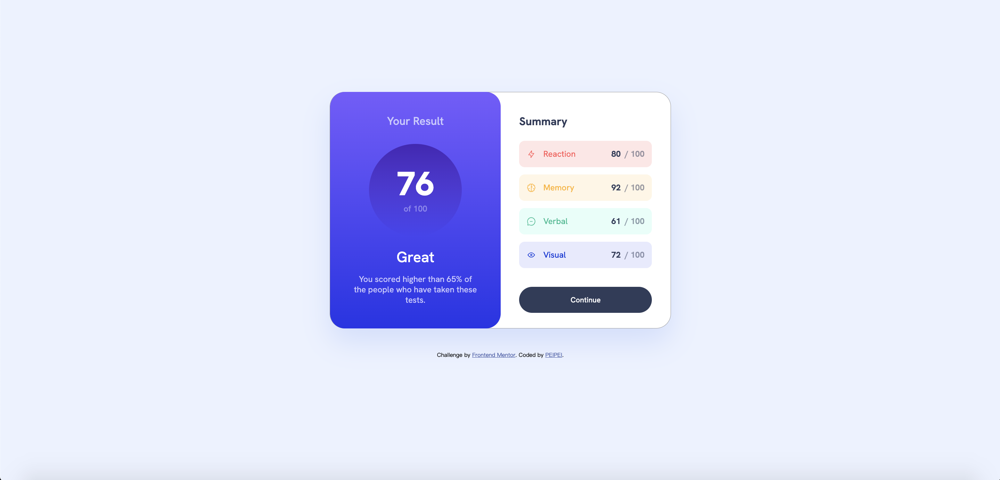

## Table of contents

- [Overview](#overview)
  - [About The Project](#about-the-project)
  - [Screenshot](#screenshot)
- [Getting Started](#getting-stated)
  - [Built with](#built-with)
  - [Installation](#installation)
- [Acknowledgements](#acknowledgements)

## Overview

### About The Project

Users should be able to:

- View the optimal layout for the interface depending on their device's screen size
- See hover and focus states for all interactive elements on the page
- **Bonus**: Use the local JSON data to dynamically populate the content

### Screenshot

## Getting Started

### Built with

- Semantic HTML5 markup
- CSS custom properties
- Flexbox
- Mobile-first workflow
- CSS Media Query
- Axios

### Installation
Clone the repo and you're ready to go!
To open this project in the browser, you may need to install extensions in your code editor.

## Acknowledgements
- [Axios from npm](https://www.npmjs.com/package/axios)
- [Readme Template](https://github.com/othneildrew/Best-README-Template#readme)
- [Normalize CSS](https://necolas.github.io/normalize.css/)

### Frontend Mentor - Results summary component solution

This is a solution to the [Results summary component challenge on Frontend Mentor](https://www.frontendmentor.io/challenges/results-summary-component-CE_K6s0maV).
